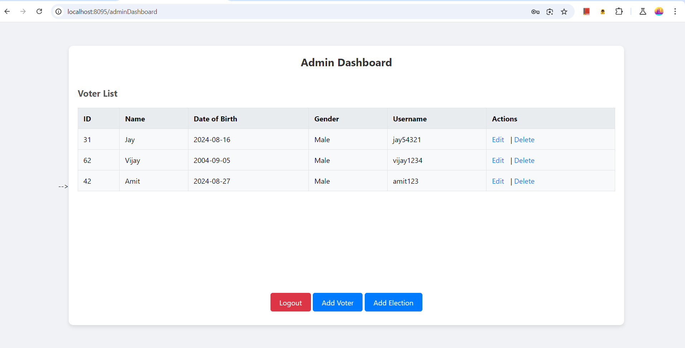
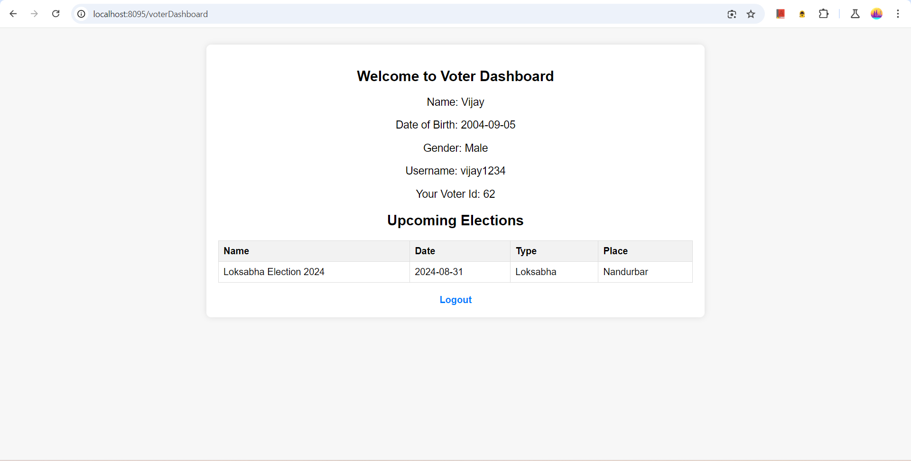
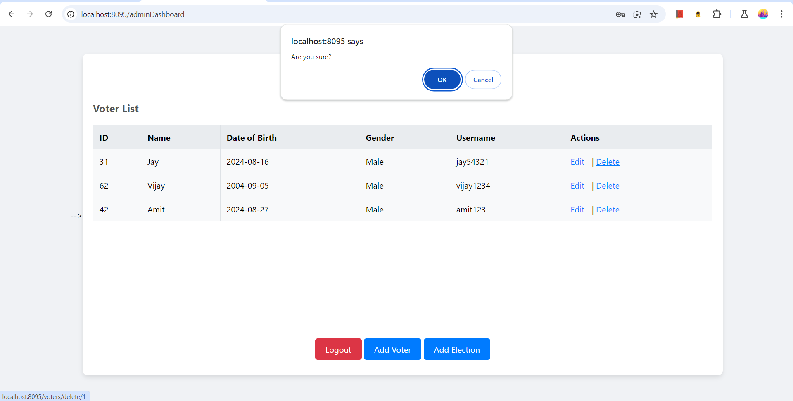
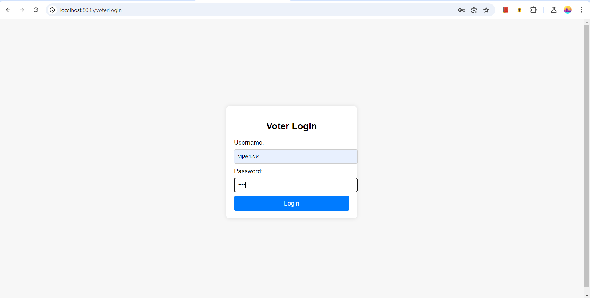
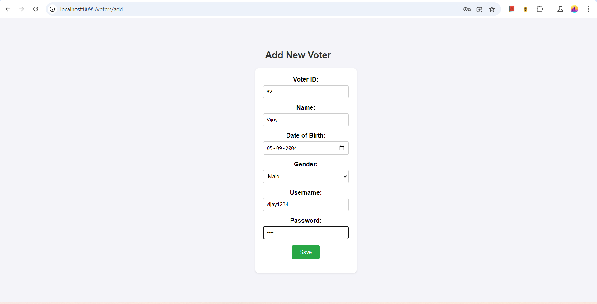
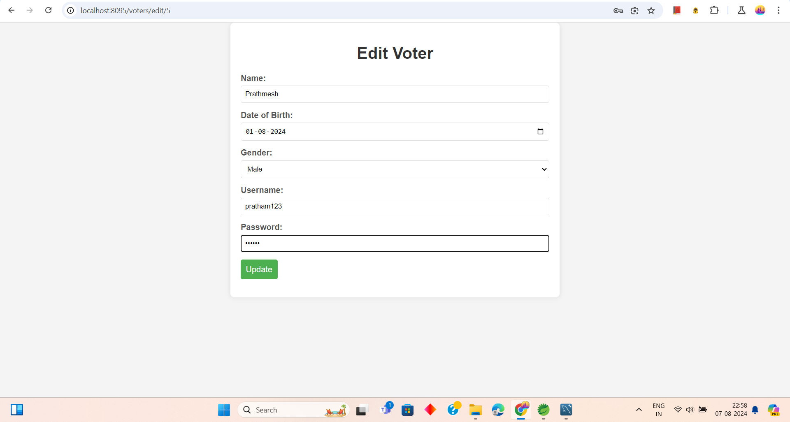
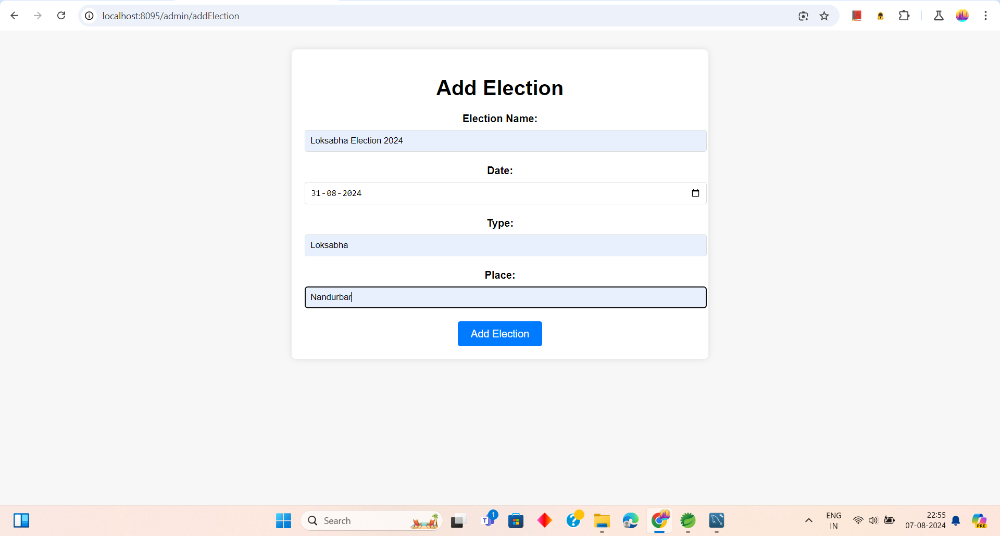
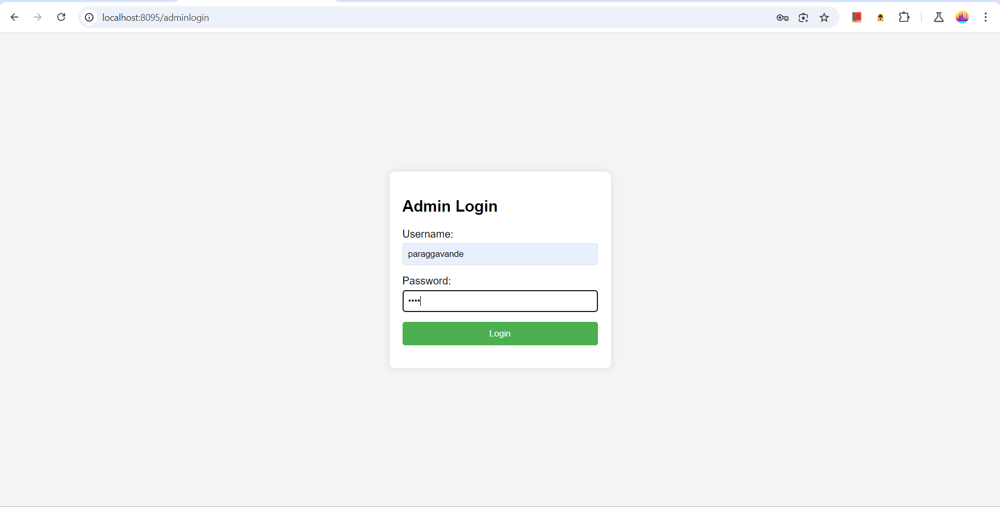
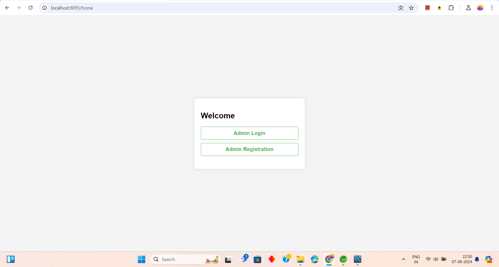

# Voter Management System

A simple Voter Management System built with Spring Boot. This application allows you to manage voter information efficiently.

## Features

- Add new voters  
- Edit existing voters
- View all voters
- Delete voters
- User-friendly interface

## Technologies Used

- Spring Boot
- MySQL
- Java
- Maven
- HTML/CSS

## Application Screenshots

